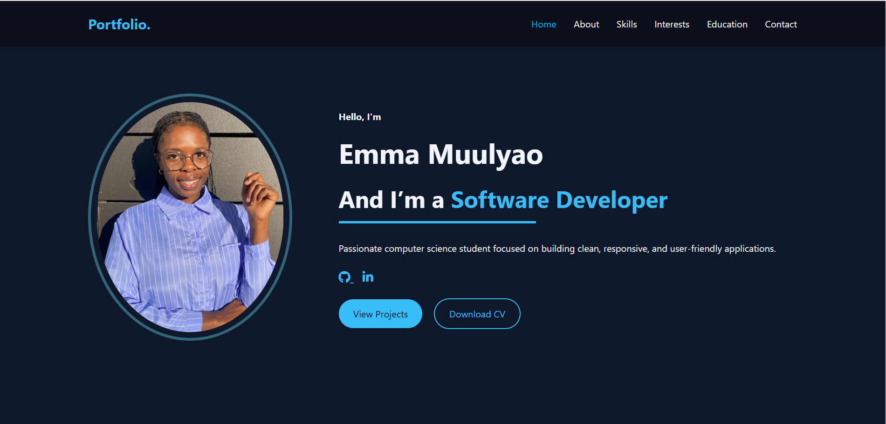

# 🌐 Portfolio Website

A modern, responsive personal portfolio showcasing my skills, projects, and journey as a Software Developer and an aspiring Full Stack Developer.

## 📌 About the Project

This portfolio website was designed and developed to showcase my technical skills, projects, and educational background. It highlights my ability to build responsive and interactive web applications using modern web technologies.

## 🚀 Features

* Smooth scrolling navigation
* Active navbar highlighting on scroll
* Typing animation effect
* Responsive design
* Contact form integration

## 🛠️ Technologies Used

- **Frontend:** HTML5, CSS3, JavaScript
- **Tools:** Git, GitHub

## 📷 Preview



## 🌍 Live Demo

👉 [View Portfolio](https://muulyao.github.io/portfolio-website/)

## 📬 Contact

Feel free to reach out via the contact form on the website.

## 📁 Installation

1. Clone the repository:

   ```bash
   git clone https://github.com/Muulyao/portfolio-website.git
   ```
2. Open the project folder
3. Run `index.html` in your browser

## ✨ Author

Emma Muulyao
Aspiring Full Stack Developer

🔗 GitHub: https://github.com/Muulyao
